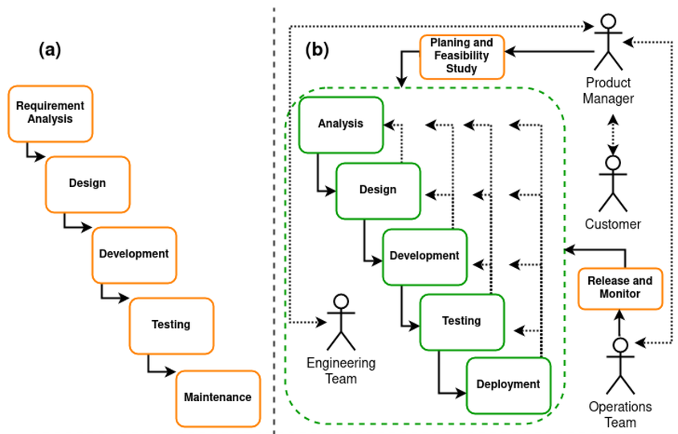
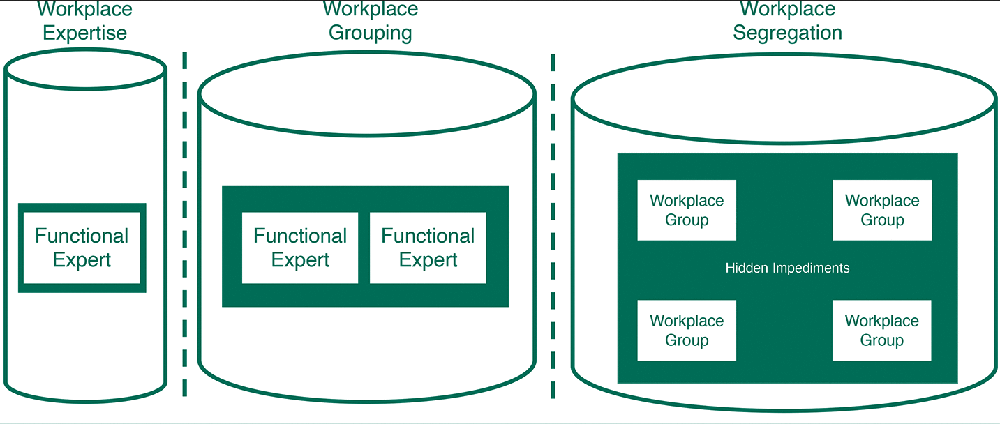

# Actividad 1: Introducción a DevOps/DevSecOps

- **Nombre** Walter Bryan Poma Navarro
- **Fecha** 2025-09-03
- **Tiempo Invertido** 

---

##Contexto del Entorno

Esta primera actividad será desarrollada en un entorno de Windows 11. La edición de los archivos markdown se hará en Visual Studio Code. La gestion de versiones se realizará con Git Bash.

---
### 4.1 DevOps vs. Cascada Tradicional

*Imagen obtenida de la fuente [1].*

**Análisis Comparativo:**
El modelo en cascada se caracteriza por ser un proceso lineal y secuencial donde cada fase (requerimientos, diseño, implementación, pruebas, despliegue, mantenimiento) debe completarse antes de iniciar la siguiente. Es un modelo simple e idealista, la desventaja que tiene es que genera ciclos de entrega muy largos y si no le gusta al customer, debe pasar por el ciclo completo otra vez.

DevOps, en cambio, centra su metodología en un ciclo iterativo y continuo que integra el desarrollo y las operaciones, para unir personas, procesos y tecnología.

**¿Por qué Devops acelera y reduce el riesgo en software para la nube frente a cascada**

Porque en Devops a diferencia de cascada los problemas son identificados mucho antes, ya que este modelo esta en constante comunicación con los customers(feedback continuo). Además se entregan cambios pequeños y frecuentes(pequeños lotes) en lugar de un único lanzamiento como en cascada, también gracias a la automatización de pruebas y despliegues se logra eliminar los errores manuales que se pueden produicir en el modelo cascada haciendo al proceso más rápido y eficiente.

**Pregunta Retadora: Contexto real donde un enfoque cercano a cascada sigue siendo razonable**
**Expón dos criterios verificables y los trade-offs**
Un enfoque similar a cascada es razonable en situaciones donde los requirimientos del proyecto estan bien definido y los objetivos finales son claros [2]. También sería razonable en proyectos donde se prefiera cumplir una conformidad regulatoria en vez de la velocidad. Un contexto real puede ser desarrollo de un firmware para un dispositivbo médico.
**Criterio verificable 1:** Aprobación del 100% de las auditorías regulatorías antes de que se libere cualquier versión.
**Criterio verificable 2:** La tasa de fallos debe ser menor al 2%, esto justifica un ciclo de pruebas riguroso y prolongado.
**Trade-offs:** Se sacrifica la velocidad de entrega a cambio de una máxima seguridad.

---
### 4.2 Ciclo Tradicional de Dos Pasos y Silos

*Imagen obtenida de la fuente [3]*

**Limitaciones del ciclo "construcción -> operación**
*Basicamente, sin CI/CD(Integración Continua y Despliegue Continuo) el trabajo se acumula en lotes grandes que sontranspasados por múltiples handoffs, caada traspaso introduce asimetrías de información y aumenta el tiempo de espera.
*El código se integra al final del ciclo , lo que con lleva a conflictos complejos (los defectos se apilan en colas) y un alto "costo de integración tardía".

**Pregunta Retadora: Define dos anti-patrones (Throw-overwall, seguridad como auditoría tardía )**

Throw over the wall: El equipo de desarrollo finaliza el código y lo entrega a Operaciones sin tener responsabilidad sobre su despliegue. Esto se agrava al elevar el MTTR(tiempo media de recuperación) por que Operaciones debe enviar el problema de vuelta a un programador y este puede estar ya en otro contexto.

Seguridad como auditoría tardía: Seguridad se involucra solo al final del ciclo. Esto empeora incidentes ya que se detectan tarde las vulnerabilidades y configuraciones debiles.

### 4.3 Principios y Beneficios de DevOps

### 4.4 Evolución a DevSecOps

