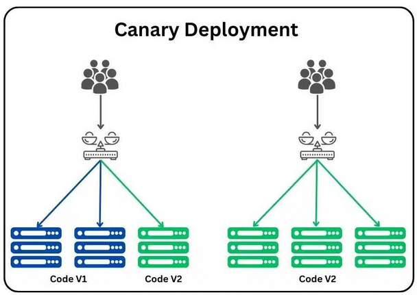

# Actividad 1: Introducción a DevOps/DevSecOps

- **Nombre** Walter Bryan Poma Navarro
- **Fecha** 2025-09-03
- **Tiempo Invertido** 3 horas 

---

##Contexto del Entorno

Esta primera actividad será desarrollada en un entorno de Windows 11. La edición de los archivos markdown se hará en Visual Studio Code. La gestion de versiones se realizará con Git Bash.

---
### 4.1 DevOps vs. Cascada Tradicional

*Imagen obtenida de la fuente [1].*

**Análisis Comparativo:**

El modelo en cascada se caracteriza por ser un proceso lineal y secuencial donde cada fase (requerimientos, diseño, implementación, pruebas, despliegue, mantenimiento) debe completarse antes de iniciar la siguiente. Es un modelo simple e idealista, la desventaja que tiene es que genera ciclos de entrega muy largos y si no le gusta al customer, debe pasar por el ciclo completo otra vez.

DevOps, en cambio, centra su metodología en un ciclo iterativo y continuo que integra el desarrollo y las operaciones, para unir personas, procesos y tecnología.

**¿Por qué Devops acelera y reduce el riesgo en software para la nube frente a cascada**

Porque en Devops a diferencia de cascada los problemas son identificados mucho antes, ya que este modelo esta en constante comunicación con los customers(feedback continuo). Además se entregan cambios pequeños y frecuentes(pequeños lotes) en lugar de un único lanzamiento como en cascada, también gracias a la automatización de pruebas y despliegues se logra eliminar los errores manuales que se pueden produicir en el modelo cascada haciendo al proceso más rápido y eficiente.

**Pregunta Retadora: Contexto real donde un enfoque cercano a cascada sigue siendo razonable**
**Expón dos criterios verificables y los trade-offs**

Un enfoque similar a cascada es razonable en situaciones donde los requirimientos del proyecto estan bien definido y los objetivos finales son claros [2]. También sería razonable en proyectos donde se prefiera cumplir una conformidad regulatoria en vez de la velocidad. Un contexto real puede ser desarrollo de un firmware para un dispositivbo médico.

**Criterio verificable 1:** Aprobación del 100% de las auditorías regulatorías antes de que se libere cualquier versión.

**Criterio verificable 2:** La tasa de fallos debe ser menor al 2%, esto justifica un ciclo de pruebas riguroso y prolongado.

**Trade-offs:** Se sacrifica la velocidad de entrega a cambio de una máxima seguridad.

---

### 4.2 Ciclo Tradicional de Dos Pasos y Silos

*Imagen obtenida de la fuente [3]*

**Limitaciones del ciclo "construcción -> operación**

*Basicamente, sin CI/CD(Integración Continua y Despliegue Continuo) el trabajo se acumula en lotes grandes que sontranspasados por múltiples handoffs, caada traspaso introduce asimetrías de información y aumenta el tiempo de espera.

*El código se integra al final del ciclo , lo que con lleva a conflictos complejos (los defectos se apilan en colas) y un alto "costo de integración tardía".

**Pregunta Retadora: Define dos anti-patrones (Throw-overwall, seguridad como auditoría tardía )**

*Throw over the wall: El equipo de desarrollo finaliza el código y lo entrega a Operaciones sin tener responsabilidad sobre su despliegue. Esto se agrava al elevar el MTTR(tiempo media de recuperación) por que Operaciones debe enviar el problema de vuelta a un programador y este puede estar ya en otro contexto.

*Seguridad como auditoría tardía: Seguridad se involucra solo al final del ciclo. Esto empeora incidentes ya que se detectan tarde las vulnerabilidades y configuraciones debiles.

---

### 4.3 Principios y Beneficios de DevOps

**CI(Conitnous Integration):** Es la integración de cambios pequeños y frecuentes, los pull request disparan pruebas automatizadas cerca del código para detectar errores de forma temprana.

**CD(Continous Deployment):** Cuando CI tiene luz verde, los cambios se despliegan automaticamente con gates objetivos como tests, seguridad, health checks.

**¿Cómo una práctica Agile (reuniones diarias, retrospectivas) alimenta decisiones del pipeline?**

Una práctica Agile va a actuar como un sensor y convierte las lecciones aprendidas por el equipo en mejoras concretas ya utomatizadas del pipeline.
Lo que se detecta en reuniones diarias / planificación/ retroespectiva se va a formalizar en gates y políticas del CI/CD que van a promover o bloquear cambios.

**Indicador observable para medir mejora de colaboración Dev-Ops**

**Tiempo desde PR listo hasta despliegue en entorno de pruebas: **

Se puede medir utilizando metadatos del Git y los registros de un servidor de CI/CD. Se va a extraer el timestamp desde la aprobación del PR hasta y se le va a restar el timestamp del log del script de despliegue exitoso.

---

### 4.4 Evolución a DevSecOps

**Diferencia SAST y DAST- ubicación en el pipeline**

Ambas son técnicas complementarias que se usan en seguridad, pero en distintas etapas, primero SAST (Static Application Security Testing), acá se analiza el código sin estar en ejecución para encontrar vulnerabilidades, mientras que DAST (Dynamic Application Security Testing) prueba la aplicación mientras esta en ejecución, simulando ataques externos para detectar fallos de seguridad, en tiempo real.

Para el SAST, se ubica muy temprano en el pipeline, idealmente en el entorno del desarrollador, mientras que el DAST se ubica más tarde en el pipeline, en un entorno de operaciones.

**Define un gate mínimo de seguridad con dos umbrales cuantitativos**

Un gate de seguridad sería como un punto de control automático que va a bloquear  un despliegue si no cumple con los umbrales de seguridad.

**"Cualquier hallazgo crítico en componentes expuestos bloquea la promoción"** 

Gate SAST( Umbral 1): 0 Vulnerabilidades críticas o altas (CVSS >=7.0) antes de promover a producción.

Evidencia:informe SAST filtrado por seguridad crítica/alta.

README: "Gate SAST: 0 vulnerabilidades críticas (CVSS ≥ 7.0). Evidencia: informe con 0 hallazgos críticos".

Política de excepción: Vulnerabilidad crítica no corregible: excepción por 7 días, responsable: líder técnico, plan: parche/mitigación (WAF, feature flag off) y re-ejecutar SAST.

**"Cobertura mínima de pruebas de seguridad del X%"**

Gate DAST (Umbral 2): ≥ 80% de cobertura de pruebas dinámicas en rutas críticas (autenticación, pagos, etc.).

Evidencia: Informe DAST para el porcentaje de endpoints probados frente al total definido en el contrato de API.

README: "Gate DAST: ≥ 80% cobertura en rutas críticas. Evidencia: informe DAST con 85% de endpoints probados."

Política de excepción: "Cobertura DAST insuficiente (72% < 80%): excepción por 7 días, responsable: líder técnico, plan: agregar pruebas autenticadas a endpoints críticos pendientes y aplicar controles compensatorios; reevaluar con DAST antes del vencimiento."

**¿Cómo evitar el teatro de seguridad?**

Midiendo eficacia, no solo el cumplimiento:

Señal de eficacia 1: Reducción de hallazgos repetidos en SAST/DAST (métrica: ≤ 5% de vulnerabilidades recurrentes). Cómo medir: Comparar informes de SAST/DAST entre despliegues consecutivos [4].

Señal de eficacia 2: Tiempo de remediación de vulnerabilidades críticas ≤ 48 horas. Cómo medir: Registrar detección (en pipeline) y corrección (commit o nuevo escaneo) [4].

---

### 4.5 CI/CD y estrategias de despliegue 

*Imagen obtenida de la fuente [5]*

**Estrategia para un microservicio crítico como la autenticación**

Para un microservicio como el propuesto, sería más conveniente usar el canary deployment, por que al estar la autenticación en una ruta crítica cualquier fallo tiene un enorme cantidad de usuarios afectados, este despliegue reduce el riesgo al exponer a una fracción controlada del tráfico a la nueva versión.

**Tabla de Riesgos vs. Mitigaciones para Despliegue Canario:**

| Riesgo | Mitigación Concreta |
|---|---|
|**Costo operativo del doble despliegue**|Límite de tiempo de convivencia (ventanas cortas) y escalado mínimo del canary.|
|**Muestreo no representativo** | Canary por cohorte(región/app/versión) y shadow traffic previo |
| **Degradación de rendimiento** | Observar la latencia p95 en el grupo canario. Si aumenta en >15%, realizar rollback. |
| **Dependencias no canarizadas** | Health checks de downstream y fallbacks; no promover si la dependencia viola su SLO. |

**KPI Primario para Promoción/Abortado:**
Para decidir si el despliegue canario es exitoso, se establece un gate automático basado en el siguiente KPI, umbral y ventana de observación:

* **KPI:** Tasa de errores del servidor (HTTP 5xx).
* **Umbral:** No debe superar el 0.1% sobre el tráfico dirigido al canario.
* **Ventana de Observación:** Durante la primera hora después de iniciar el despliegue.
* **Decisión:** Si el KPI se mantiene por debajo del umbral durante toda la ventana de observación, el despliegue se promueve gradualmente al 100% de los usuarios. Si en algún momento el umbral se supera, se activa un rollback automático que revierte la nueva versión de forma inmediata.

**Pregunta retadora: si el KPI técnico se mantiene, pero cae una métrica de producto (conversión), explica por qué ambos tipos de métricas deben coexistir en el gate**

Esto puede ocurrir si es que la neuva versión introduce un cambio de diseño que pueda confundir a los usuarios y le s impide realizar una acción(compra o registro). Además, cada métrica es distinta porque responden a preguntas diferenntes, por ejemplo la métrica Técnica del KPI valida la estabilidad de la aplicación, mientras que la métrica del producto, valida que la aplicación siga cumpliendo su objetivo de negocio.

---

### 4.6 Fundamentos Prácticos Sin Comandos

**HTTP - contrato observable**

Para la captura, el método HTTP es GET, el status 200, y las cabeceras escogidas son cache-control y content-type:

cache-control: private ,max-age=0: el private le indica al navegador que el response contiene la información para un solo ussuario y no debe ser almacenado en una caché compartida, y el max-age =0 establece la edad maxima del recurso en cero es decir, el anvegador recibió un contenido y este ya es obsoleto apenas llega. Basicamente esta cabecera le dice al navegador que puede guardar una copia de este archivo durante un tiempo, en este caso 0 segundos.

content-type: text/html; charset=UTF-8: Le informa al navegador que esto es una página (HTML), usa el diccionario uuniversal UTF-8, para que sepa como interpretarlo y mostrarlo.

**DNS - nombres y TTL**

En la captura se hace una consulta DNS para el dominio google.com utilizando la herramienta nslookup en modo debug para obtener la información detallada. Se observa que la consulta devolvió un registro de tipo A, este registro asocia el nombre de un dominio a una direccion IPv4, los datos encontrados fueron:

*Dominio: google.com

*Tipo de registro: A

*Dirección IP: 142.251.132.174

*TTL: 158 segundos

El TTL es una instrucción que le dice a los servidores y SO cuanto tiempo deben almacenar en caché una copia de este registro antes de volver a preguntar. Un TTL bajo permite que los cambios en la infraestructura de  Google se propaguen en internet muy rápido, además si un despliegue sale mal y necesita un rollabck (revertir a una configuración anterior) este TTL bajo asegura que la corrección se aplique casi de inmediato.

**TLS - seguridad en tránsito**

Se inspeccionó el certificado de seguridad del dominio github.com y en la captura se muestra: CN/SAN(Common Name/Subject Alternative Name): El certificado es válido para los dominos github.com y www.github.com, Emisora es Sectigo ECC Domain Validation Secure Server CA que es la Autoridad de Certificación (CA) que verificó la identidad del sitio y firmó el certificado. y la vigencia desde el 5 de febrero de 2025 hasta el 5 de febrero del 2026.

Si la cadena de un certificado no se valida, el navegador no puede confiar en la identidad del sevidor al que se conecta, lo que conlleva a una serie de problemas críticos de seguridad.

**Puertos - estado de runtime**

Se utilizó el comando netstat -ano | findstre LISTENING para inspeccionar los puertos en estado de escucha en el sistema.

El puerto 445 en 0.0.0.0, significa que el servicio esta aceptando conexiones desde cualqueir interfaz de rede del equipo.

El puerto 9009 en 127.0.0.1, significa que el servicio solo acepta conexiones originadas desde la propia máquina.

La revisión de puertos en estado LISTENING permite verficiar el estado de las aplicaciones y solucionar problemas, por ejemplo si se despliega una aplicación que debería estar disponibnle en un puerto específico, pero no aparece en la lista es una clara señal de que la apliación fallo al iniciarse o no pudo vincularse al puerto, otro error muy comun es el de "Adress already in use", esto indica que otro proceso está ocupadno el puerto deseado.

**12-Factor - port binding, configuración logs**

Para parametrizar el puerto de la aplicación, se utilizan variables de entorno. "Las variables de entorno se modifican fácilmente entre despliegues sin realizar cambios en el código"[6].

Los logs en ejecución se deben ver como un flujo de eventos dirigidos a la salida estándar y al error estándar. No se deben escribir en archivos locales porque esta práctica no escala en entornos distribuidos [7].

Un antipatrón clásico es incrustar credenciales o configuraciones en el código como URL de una base de datos de desarrollo, esto destruye la reproducibilidad porque el mismo artefacto no puede ser desplegado en diferentes entornos (desarrollo, producción) sin modificar el código, cada entorno requerirá un cambio y un nuevo build invalidando el principio de codebase[7,8].

**Checklist de diagnóstico**

Escenario: usuarios reportan intermitencia.

a) Paso 1: contrato HTTP roto

Objetivo: Verficiar si el cliente puede comunicarse correctamente con el servidor y recibe respuesta válida.

Evidencia: Usar la herramienta de desarrollador del navegador para inspeccionar la pestaña "Red". Se busca código de estado 200 OK.

Interpretación:

Si el código es 200 OK, el contrato HTTP básico funciona, Pasar al Paso 2.

Si el código es 4xx o 5xx el contrato HTTP está roto. *Acción:* Escalar al equipo de desarrollo.

b) Paso 2: resolcuión DNS inconsistente

Objetivo: Confirmar que el dominio resuelve a la dirección IP correcta desde diferentes ubicaciones.

Evidencia: Usar una herramienta online o comando de Sistema Operativo para consultar el registro A del dominio. Se busca que la mayoría de los servidores a nivel mundial reporten la misma dirección IP.

Interpretación:

Si la IP es consistente, el DNS está funcionando correctamente. Acción: Pasar al paso 3.

Si se observan IPs diferentes o errores de resolución, el DNS es inconsistente. Acción: Revisar la configuración DNS y el TTL; esperar a que se propague el cambio correcto.

c) Paso3: Certificado TLS caducado/incorrecto

Objetivo: Asegurar que el certificado de seguridad del sitio sea válido y de confianza.

Evidencia: Hacer clic en el candado del navegador para ver los detalles del certificado. Se busca que las fechas de "Válido desde/hasta" estén vigentes y que el nombre del dominio (CN/SAN) coincida.

Interpretación:

Si el certificado es válido, la capa TLS es correcta. Acción: Pasar al paso 4.

Si el certificado está caducado o el nombre no coincide, esta es la causa del error. Acción: Renovar o reinstalar el certificado TLS inmediatamente.

d) Paso 4: puerto mal configurado/no expuesto.

Objetivo: Confirmar si el servicio está escuchando en el puerto esperado desde la propia máquina del servidor.

Evidencia: En la terminal del servidor, ejecutar curl localhost:<PUERTO>. Se espera recibir una respuesta HTML o JSON, no un error de "conexión rechazada".

Interpretación:

Si se obtiene una respuesta, el servicio está corriendo correctamente a nivel local. 

Si la conexión es rechazada, el puerto no está expuesto o el proceso de la aplicación no se inició. Acción: Revisar el código de la aplicación y la configuración de arranque.

---