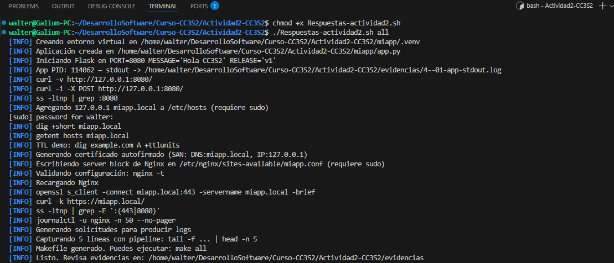
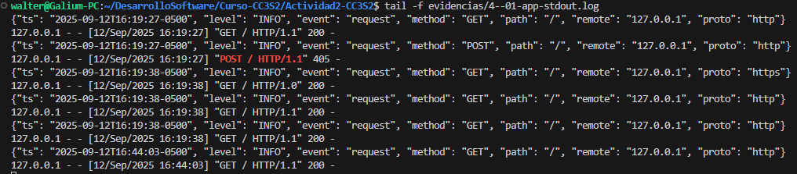
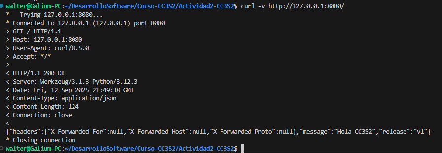

# Actividad 2: HTTP, DNS, TLS y 12-Factor

**Nombre:** Walter Bryan Poma Navarro

**Fecha:** 12 de septiembre de 2025

---

Para realizar esta actividad, se utilizó el script Respuestas-actividad2.sh proporcionado. Este script se encargó de configurar el entorno, generar los archivos necesarios, ejecutar todas las pruebas y recopilar las evidencias de manera automática. 

El flujo completo se ejecutó con el siguiente comando en la terminal:

walter@Galium-PC:~/.../Actividad2-CC3S2$ ./Respuestas-actividad2.sh all

---

## 1. HTTP:Fundamentos y Herramientas

## Evidencia de la aplicación levantada

{"ts": "2025-09-12T16:19:26-0500", "level": "INFO", "event": "startup", "port": 8080}
 * Serving Flask app 'app'
 * Debug mode: off
WARNING: This is a development server. Do not use it in a production deployment. Use a production WSGI server instead.
 * Running on all addresses (0.0.0.0)
 * Running on http://127.0.0.1:8080
 * Running on http://172.30.13.165:8080
Press CTRL+C to quit

### Inspección con curl

*Evidencia de `curl -v`

*Resultado de `curl -X POST` 

HTTP/1.1 405 METHOD NOT ALLOWED
Server: Werkzeug/3.1.3 Python/3.12.3
Date: Fri, 12 Sep 2025 21:19:27 GMT
Content-Type: text/html; charset=utf-8
Allow: OPTIONS, GET, HEAD
Content-Length: 153
Connection: close

<!doctype html>
<html lang=en>
<title>405 Method Not Allowed</title>
<h1>Method Not Allowed</h1>

The method is not allowed for the requested URL.

Se recibe un código `405 Method Not Allowed` porque la ruta `/` solo fue programada para aceptar el método GET.